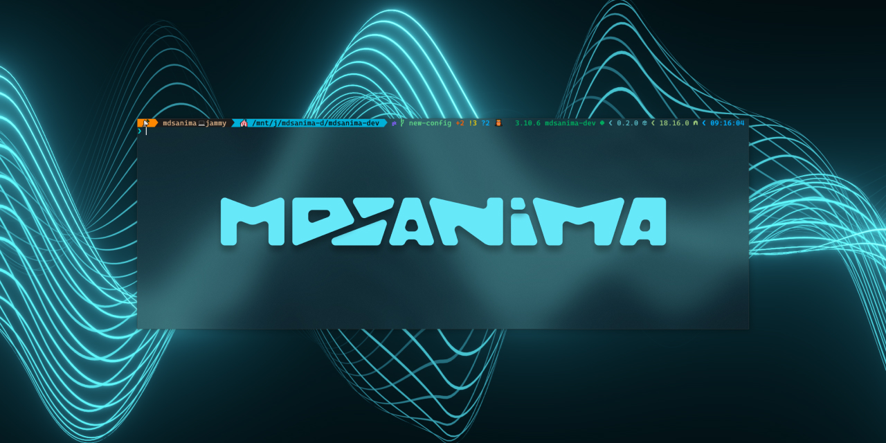

# {octicon}`gear;1em;sd-text-secondary` `THEME`

This documentation site is generated with the Sphinx and the customized Furo theme.

I make this theme is a complete different that's original Furo theme. It is customized to my needs and, above all, the
light theme options have been turned off.

If you want to check what changes have been made please check the `mdsanima.css` file which is in `/docs/_static/`
directory on this package repository and you can also see it in [CHANGELOG](../development/changelog/) pages.

You can navigate through the docs by using the keyboard with the Left Arrow {kbd}`<` or Right Arrow {kbd}`>` key.

## THEME `CUSTOMIZED`

All `markdown` files that we write in this repository for documentation or quick tutorials that will also been posted in
this repository must be written in a specific way to maintain unity and transparency.

```{attention}
The `markdown` file must be started just like any other file that is now in the documentation. The first paragraph must
contain an `octicon` and a name in the backtick that generates a capital literal code. The second paragraph and the
others must also be capitalized, the first part must be normally spelled and the second part of the name in the backtick
code letter.
```

All internal links should be look like [this example](#theme-customized) link. However, all external links that lead to
other pages should also contain an icon informing that you are going to another page like
[this example {octicon}`link-external;0.8em`](https://github.com/mdsanima-dev/) link which goes to the GitHub
**mdsanima-dev** page organization.

In addition, each documented page written in `markdown` should contain an appropriate metatag and corrected page title
and description. For this options we're add [sphinxext-opengraph {octicon}`link-external;0.8em`][opengraph] extension to
generate OpenGraph metadata. For debug metadata praview how our webpage documentation will look on Google, Facebook,
Twitter and more please check [debug meta tag](../reference/#debug-meta-tag) links section.

```{important}
Please just check how this file is written in the repository that generates this page. We also adhere to the fact that
files written in markdown for documentation should be written up to 79 characters per line. There may be exceptions when
adding a link and there may be more characters on one line.
```

It may also happen that the text is not written correctly in the English language. My native language is Polish and
please don't laugh if something is misspelled. Every day I try to improve my writing and speaking in English, but this
is hard for me.

[opengraph]: https://github.com/wpilibsuite/sphinxext-opengraph

## EXAMPLE `MARKDOWN`

Here is some examples of how we can write documentation in `markdown` file with reStructuredText `rst` directive.

This is a `code-literal` text written in `markdown` file.

```{eval-rst}
:EXAMPLE: code-literal-text
```

```{eval-rst}
:file:`/etc/passwd`
:kbd:`ctrl` + :kbd:`s`
```

You can also make this {code}`example code` literal with `rst` directives code:

```markdown
{file}`/etc/passwd`
{kbd}`ctrl` + {kbd}`s`
```

## EXAMPLE `ICONS`

This is an example of **Font Awesome Icons** with custom size and color with standard `html` code.

<i class='fab fa-markdown' style='font-size:24px;color:red'></i>
<i class="fas fa-terminal"></i>
<i class="fab fa-bitcoin"></i>

Markdown should be a this `html` code:

```markdown
<i class='fab fa-markdown' style='font-size:24px;color:red'></i>
<i class="fas fa-terminal"></i>
<i class="fab fa-bitcoin"></i>
```

You can also make this icons with `rst` directive.

{fab}`fa-solid fa-markdown fa-2x sd-text-primary`
{fas}`fa-solid fa-terminal fa-2x sd-text-info`
{fab}`fa-solid fa-bitcoin fa-2x sd-text-warning`

Markdown should be a this `rst` directive code:

```markdown
{fab}`fa-solid fa-markdown fa-2x sd-text-primary`
{fas}`fa-solid fa-terminal fa-2x sd-text-info`
{fab}`fa-solid fa-bitcoin fa-2x sd-text-warning`
```

This is an example of **Octicon Icons** with custom size and color.

{octicon}`desktop-download;48px`
{octicon}`report;48px;sd-text-primary`
{octicon}`report;48px;sd-text-secondary`
{octicon}`report;48px;sd-text-success`
{octicon}`report;48px;sd-text-warning`
{octicon}`report;48px;sd-text-danger`
{octicon}`report;48px;sd-text-info`
{octicon}`report;48px;sd-text-light`
{octicon}`report;48px;sd-text-dark`
{octicon}`report;48px;sd-text-muted`

Markdown should be a this `rst` directive code:

```markdown
{octicon}`desktop-download;48px`
{octicon}`report;48px;sd-text-primary`
{octicon}`report;48px;sd-text-secondary`
{octicon}`report;48px;sd-text-success`
{octicon}`report;48px;sd-text-warning`
{octicon}`report;48px;sd-text-danger`
{octicon}`report;48px;sd-text-info`
{octicon}`report;48px;sd-text-light`
{octicon}`report;48px;sd-text-dark`
{octicon}`report;48px;sd-text-muted`
```

When you want to add the same icon, but in directives `eval-rst` inside `markdown` file you must use a colon instead of
the curly brace `{fas}` and `{octicon}` like this `:fas:` and `:octicon:` and rest of code to generate icons.

This is a example of adding a `img` or `svg` with custom size.




Markdown should be a this `html` code:

```markdown


```

## EXAMPLE `BLOCK CODE`

Block code in this theme has been changed so that if you want to use a block code you can use three examples that differ
in color on the front and back edges.

The `python` block code is rendered like this and is marked with {bdg-success-line}`green` color:

```python
from mdsanima_dev.emoji import show
```

The `shell` block code is rendered like this and is marked with {bdg-warning-line}`orange` color:

```shell
mdsanima-dev frames-to-timecode --help
```

The `markdown` block code is rendered like this and is marked with {bdg-primary-line}`blue` color:

```markdown
{octicon}`desktop-download;48px`
```
